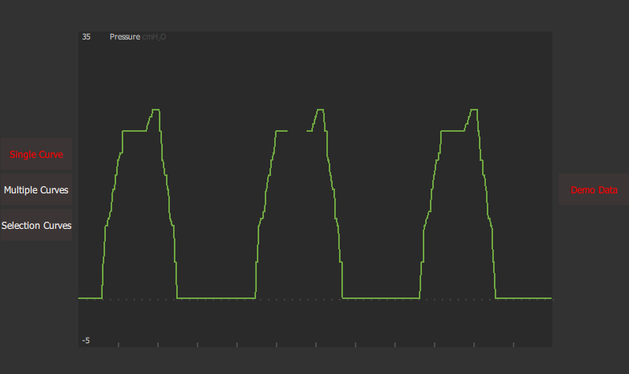
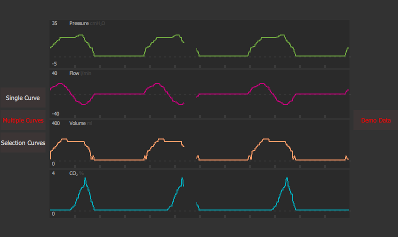
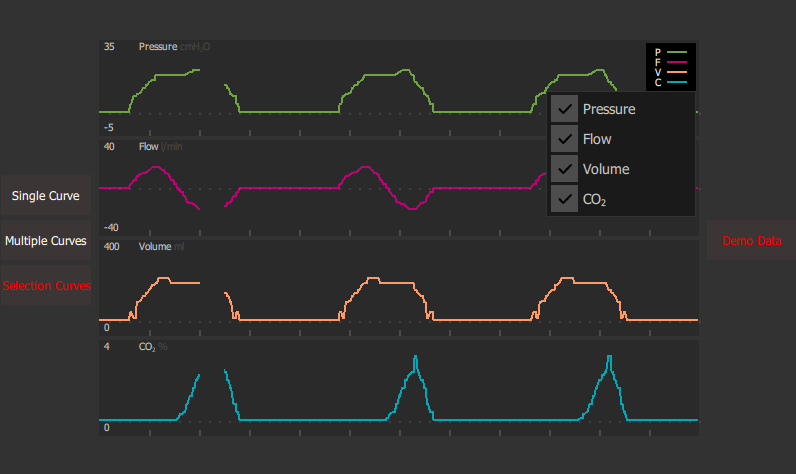
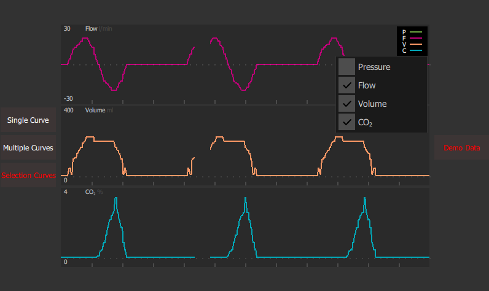

[us_en](README.md) 
[zh_cn](README_zh_cn.md)
# QtMedicalCurve
Qt Quick实现的简单医疗波形图

实现如何在Qt Quick上用QPaint创建可以画波形的组件.

## 功能

* 提供简单接口缓存波形数据,并在QPixmap上进行更新
* 通过移动擦除条进行旧有数据的擦除和新数据的更新
* 支持多个波形图组件联合
* 支持自动放大和缩小y轴方向的波形
* 提供统一的波形管理类来管理所有的波形组件
* 提供统一的波形重绘触发器来触发所有波形组件的重绘

## API

### 接收数据
```cpp
// slot in CurveManager
CurveManager::onReceiveNewData(CurveData data,int type)
```

### 更新图表
```cpp
// slot in CurveManager
CurveManager::onTriggerCurveUpdate()
```

## 注意
* 在Windows只支持MinGW 64-bit 编译

## 截屏









## 已知问题

* 有时在擦除最开始区域后重绘新数据时,会有很小的点没有擦除干净